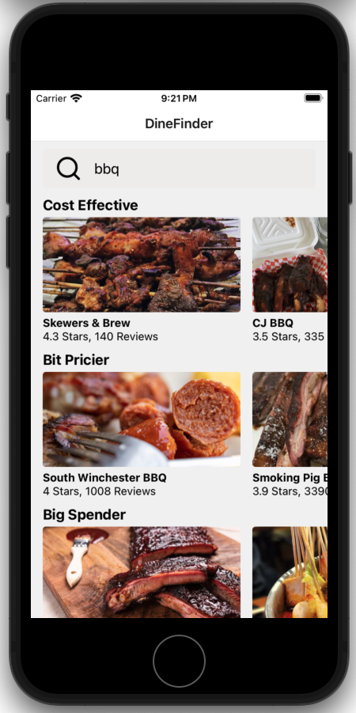

# DineFinder: Your Gateway to Gastronomic Delights

## Overview:

DineFinder is a mobile application developed using React Native, designed to simplify the process of discovering and selecting restaurants for users. By utilizing the Yelp API, it allows users to search for food and presents them with various restaurant options sorted by price range, enabling them to make choices that best fit their budget and culinary preferences.

## Key Features
- **Cross-Platform Compatibility:** Utilizes React Native and Expo CLI to provide a seamless experience across both Android and iOS devices.
- **Seamless Restaurant Discovery:** Offers an intuitive search feature that connects users with restaurants by matching their specific food cravings via the Yelp API.
- **Smart Filtering by Price:** Enables users to filter search results based on price, helping them find dining options that align with their budget.
- **Detailed Restaurant Information:** Allows users to access comprehensive details about restaurants, including menus, reviews, photos, and more, with just a click on any search result.

## Technologies Used:

- **React Native:** A framework for building native apps using React.
- **Expo:** An open-source platform for universal native apps.
- **Expo CLI:** Command line interface for Expo.

### NPM Packages
- **React** 
- **React Native** 
- **Expo** 
- **Expo CLI**

## How to Run the App
Prerequisites:

Ensure you have Node.js installed on your system.
Install Expo CLI by running `npm install -g expo-cli`.

Installation:

Clone the repository to your local machine using `git clone https://github.com/tianl-h/Mobile_Restaurant_APP.git`.
Navigate to the project directory and install the required dependencies by running npm install.

Running the App:

Start the application by running `npm start`. This command will open up a browser tab; from there, you can run the app on an emulator or your own mobile device using the Expo app.

## Screenshots:

## Contributors:

- <strong>Tianling Hou</strong>
  

